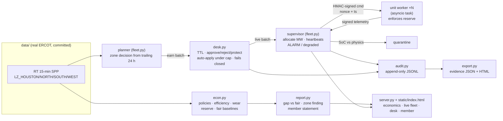

# WattGap

**Fail-closed dispatch for a home-battery fleet, priced on real ERCOT data, explained to the member.**

WattGap reads real ERCOT load-zone prices and decides CHARGE / HOLD / DISCHARGE for a fleet of home batteries. It commits megawatts through a human dispatch desk that fails closed. It sends every command signed and replay-protected. It keeps delivering when units die, partition or lie about their state. Every decision lands in an audit log that becomes an evidence pack, and a member-facing receipt says what each battery did.

**Base Power × AITX Talent Hackathon** · Austin · Sep 25–27, 2026
**Tracks entered:** **Orchestration** + **Most Commercializable**. Open Grid Data is the engine underneath (real ERCOT prices, fair-baseline economics, a zone-congestion finding), not a third entry. The rules allow two tracks per project.


## Results (real ERCOT prices, simulated batteries)

From `make report`. Per home, averaged over one home in each of the four load zones:

| Day (Central time) | Naive overnight | **Fair schedule** | **WattGap** | **Gap vs fair** |
|---|---:|---:|---:|---:|
| 2023-09-06, ERCOT scarcity evening | $0.17 | $68.57 | $44.69 | **−$23.88** |
| 2026-09-21, ordinary day this week | $0.06 | $0.25 | $1.03 | **+$0.78** |
| **Sep 1–30 2023, 30 real days** | | $187.11 | $269.17 | **+$82.07** (won 25 of 30 days) |

- **Fair schedule** means charging 00:00–06:00 CT and discharging evenly over 17:00–21:00 CT. That's the baseline to beat. "Naive overnight" charges at night and never discharges, so it's shown only for reference.
- **On the scarcity day WattGap loses by $23.88/home.** It sold at 13:45 CT, when prices first reached the top 10% of the trailing 24 h, and was at its reserve before the 18:30–19:30 peak ($5,339.52/MWh in LZ_WEST at 19:30). The fixed evening window happened to line up with that peak. We report that loss rather than tune the policy to this one day. Across all 30 September days WattGap wins by $82.07/home. Its worst day is that same Sep 6, and its best is Sep 8 (+$61.97).
- **Zone finding (Open Grid Data):** during the 21 scarcity intervals on 2023-09-06 (four-zone average ≥ $1,000/MWh, 13:45–20:15 CT), **LZ_SOUTH cleared $460/MWh below the four-zone average on average, and $1,476/MWh below at worst**. Houston, North and West sat $109–$181 above it. The same battery earned **$217.31 in South vs $308.10 in West** over September under WattGap. A fleet schedule that treats every zone the same can't see that.
- **Every run holds the 20% member reserve.** The lowest state of charge anywhere in the September runs is 20%, and a test checks it.

Economic assumptions (stated, not Base Core specifications):
- 40 kWh / 20 kW battery, 90% round-trip efficiency (√0.9 on each leg)
- $0.02/kWh wear cost on energy discharged
- 20% reserve that is never discharged
- 15-minute settlement
- Energy left at the end of a run valued at that day's median zone price, so policies aren't rewarded for selling off their starting charge

## Quick start

```bash
git clone https://github.com/saivarun3407/wattgap && cd wattgap
make setup        # python3 -m venv .venv && pip install -r requirements.txt   (Python 3.11+)
make test         # 31 tests
make demo         # the scripted story, end to end, ~7 s; writes out/evidence.{json,html} and out/audit.jsonl
make report       # economics on the real days
make serve        # web UI at http://localhost:8000
make bench        # 10k and 50k unit benchmark
```

No API keys. No network access at runtime; the ERCOT prices are committed in `data/`.

## The demo (`make demo`)

It replays **2023-09-06** from 13:00 CT with **400 independent battery workers** (one asyncio task each):

1. Economics table and zone finding (as above).
2. Prices rise, and the planner opens a **5.60 MW earn batch**. That's above the 0.25 MW auto-apply cap, so it **waits for the desk**. The operator approves, and signed commands fan out.
3. **Kill 30% of LZ_HOUSTON** (30 of 100 units). The next tick delivers 5.18 of 5.60 MW and raises an ALARM, because those units went silent. The tick after, the lost MW is re-spread across the 370 healthy units and **5.60 MW is delivered**.
4. **A rogue unit reports 100% SoC while physics says 20%: quarantined.** A command signed with the wrong key is **rejected: bad signature**. A captured command replayed is **rejected: replayed nonce**.
5. **All of LZ_WEST is partitioned** for two ticks: units go suspect, then dead, and there's an ALARM and degraded mode. Then they're recovered. A **stale price feed** means HOLD everything.
6. **The desk dies.** Every pending batch expires ("desk-dead"), and **0 ticks discharge without a live batch**.
7. The desk comes back, the operator approves, then **the member presses Protect**: the live batch is cancelled and every home's reserve is locked at its current charge.
8. **Evidence pack**:

```
  decisions_count                25
  approvals_count                3
  expirations_count              3
  alarms_count                   5
  quarantines_count              1
  security_count                 2
  discharge_without_live_batch   0
  mwh_delivered                  6.93
  wrote out/evidence.json, out/evidence.html, out/audit.jsonl (412 lines)
```

## Architecture



**Tech stack:** Python 3.11+ (stdlib `asyncio`, `hmac`, `hashlib`), FastAPI + Uvicorn for the web server, one static HTML page with vanilla JS and inline SVG (no build step), pytest. Playwright (optional) for screenshots. pandas/openpyxl/requests (optional) only to re-download the data.

| Module | What it does |
|---|---|
| `wattgap/data.py` | Loads the committed ERCOT CSVs (Central time) |
| `wattgap/econ.py` | Battery physics, the three policies, reason text, backtest with terminal valuation |
| `wattgap/report.py` | Real-day comparison, the September month, zone finding, member statements |
| `wattgap/fleet.py` | Unit workers, network (with partitions), supervisor: allocation, heartbeats, quarantine, ALARM |
| `wattgap/desk.py` | Batches, TTL, approve/reject/protect, auto-apply cap, fail-closed on desk death |
| `wattgap/security.py` | Per-device HMAC keys, signing, verification with timestamp window and nonce replay guard |
| `wattgap/audit.py` · `export.py` | JSONL audit and the evidence pack |
| `wattgap/live.py` | A running fleet replaying one day, shared by the demo and the UI |
| `wattgap/demo.py` · `bench.py` · `server.py` | Scripted story, benchmark, web app |

### How the pieces behave

- **Policy (WattGap).** Charge when a zone's price is in the cheapest 25% of its trailing 24 h. Discharge when it's in the top 10% **and** above breakeven (cheap price ÷ efficiency + wear). The rule is causal: it only ever sees past prices, with the prior day seeding the window. The reason text separates **system-wide** conditions (four-zone average) from **zone congestion** (one zone far from that average).
- **Commitments.** The planner commits 70% of the healthy units' deliverable kW (30% kept as failure headroom) for one hour (four intervals). Commitments at or under **0.25 MW** auto-apply, but only while the desk is alive. Anything bigger waits for an operator.
- **Failure handling.**
  - A unit that misses a heartbeat is *suspect* and gets no work. Two misses make it *dead*. It *recovers* when a signed, plausible heartbeat arrives.
  - Lost MW is re-spread over healthy units in proportion to their headroom, within power and reserve limits.
  - If that can't cover the commitment, the supervisor raises **ALARM** and runs degraded rather than overdriving anyone.
  - A stale price feed means HOLD.
- **Fail closed.** A pending batch expires on its TTL (90 s in the demo, 40 s in the UI). If the desk stops heartbeating, **all** pending batches expire and none can be approved later. An approved batch keeps running its commitment window.
- **Protect (member guarantee).** Cancels every pending and live earn batch and raises every home's reserve floor to its current charge. The unit enforces the floor itself, because the reserve travels inside every signed command.
- **Security.**
  - Each device's key is `HMAC-SHA256(WATTGAP_FLEET_SECRET, "device:<id>")`.
  - Commands and telemetry carry a nonce and a timestamp. Anything outside ±30 s, with a reused nonce, or with a bad signature is rejected and logged.
  - Telemetry whose SoC can't be explained by the reported power is quarantined.

## Reproduce the demo

1. `cp .env.example .env` (optional). The only variable is `WATTGAP_FLEET_SECRET`, used to derive the device keys. If it's unset, an ephemeral dev secret is generated at startup and a warning is logged. **No API keys are needed.**
2. `make setup && make demo`. Output goes to `out/`: `audit.jsonl`, `evidence.json`, `evidence.html`.
3. Web UI: `make serve`, then open http://localhost:8000. It replays 2023-09-06 from 13:00 CT, one interval every 2 s. Use the chaos buttons (kill 30% of a zone, partition, stale feed, rogue SoC, forged/replayed command), approve or reject on the desk, kill and revive the desk, and toggle Protect on the member card. **Evidence pack ↗** exports the run.
4. Screenshots: `pip install playwright`, then `make serve &` and `make shots` (uses the system Chrome, or run `playwright install chromium`).

## Datasets and provenance

All prices are **real ERCOT** real-time 15-minute Settlement Point Prices for LZ_HOUSTON, LZ_NORTH, LZ_SOUTH and LZ_WEST (Settlement Point Type `LZ`). Full details are in [data/PROVENANCE.md](data/PROVENANCE.md).

| File | Source | Dates (CT) |
|---|---|---|
| `data/ercot_rtm_spp_2023-09.csv` | NP6-785-ER Historical RTM Load Zone and Hub Prices (MIS reportTypeId 13061), 2023 file | 2023-08-31 → 2023-09-30 |
| `data/ercot_rtm_spp_2026-09-20_21.csv` | NP6-905-CD Settlement Point Prices (MIS reportTypeId 12301) | 2026-09-20 → 2026-09-21 |

Retrieved 2026-09-25 11:31 and 11:33 CT (`data/retrieved_at.json`) with `scripts/fetch_ercot.py`. The battery fleet is **simulated**. No Base data or API is used.

## Performance (measured)

`make bench` on this box (Python 3.13.5, x86_64, 8 CPUs, **single process**). Each tick means: plan, sign one HMAC command per unit, every worker verifies and applies it, signs telemetry, and the supervisor verifies every reply and checks SoC physics.

| Units | Startup | p50 tick | Max tick | Unit commands/s |
|---:|---:|---:|---:|---:|
| 10,000 | 0.15 s | 367.8 ms | 388.1 ms | 27,186 |
| 50,000 | 1.10 s | 2,082.4 ms | 2,203.0 ms | 24,011 |

A tick stands for a 15-minute ERCOT interval, so 50k units use about 2 s of a 900 s budget on one core. Nothing beyond 50k, multi-process runs or real networks was measured.

## Tests

`make test` runs **31 tests**, covering:
- **Economics:** reserve never violated; no discharge below the floor; energy conservation including efficiency; $ matches hand calculation; baselines sane (naive never discharges, schedule only in its windows); Central-time hours; trailing window seeded from the prior day; leftover energy valued; reason text separates system from zone; gap computed against the fair baseline.
- **Orchestration:** fleet count not hard-coded; no discharge without desk approval; auto-apply only under the cap; expired batches never execute; kill 30% then rebalance to target; ALARM and degraded mode when capacity can't cover; partition goes suspect, dead, recovered; stale feed holds; rogue SoC quarantined; forged and replayed commands rejected; Protect cancels and locks the reserve; audit log is append-only JSONL with one dispatch line per tick.
- **Security:** valid, tampered, wrong-key, replayed and stale messages.
- **Export and web API** end to end.

## Known limitations

- **The fleet is simulated.** No Base hardware, firmware, telemetry or API. Home load isn't modelled, so the reserve is a state-of-charge floor, not hours of backup.
- **The policy is a simple threshold rule, and it loses on the biggest scarcity day** (−$23.88/home on 2023-09-06) because it sells too early. There's no forecast and no optimization.
- **The economics are energy-only** at load-zone real-time prices. No ancillary services, no retail tariff, no demand charges, no settlement nuance. Battery specs and wear cost are assumptions.
- **"Congestion" is inferred** from load-zone spreads, not from ERCOT shadow prices or constraint data. No load or generation-mix data is used.
- **Member $ is grid value, not a bill credit.** How value reaches a member depends on Base's plan, which we don't know.
- **Symmetric HMAC keys** derived from one fleet secret. A real fleet would use per-device asymmetric keys in secure hardware plus key rotation.
- **One process, in-memory state.** The desk, supervisor and workers share one event loop. There's no persistence beyond the JSONL audit and no real network.

## Next steps

1. Hold energy for scarcity: a price-forecast or rank-based discharge rule, backtested on all of summer 2023, not one day.
2. Commit per zone from the congestion signal: shift MW toward zones trading at a premium.
3. Real telemetry and heartbeats over MQTT, per-device asymmetric keys, key rotation.
4. Model home load, so the reserve can be stated in backup hours.
5. The earlier idea list (forecasting, demand response, ancillary services, carbon, degradation-aware dispatch, engagement) stays in [docs/archive](docs/archive) as unvalidated ideas.

## What existed before the event

Kickoff was **Friday Sep 25, 2026, 5:30 PM CT**. Per `git log`, all of the commits below predate it.

**On `main`, Sep 23, 2026 (CT):** planning docs plus a ~210-line stdlib prototype (`sim/`) that ran on a **synthetic** price file and had a naive baseline stuck at $0.
- `0b42589` 12:35: WattGap opportunity scanner prototype
- `6058376` 12:46: FleetPulse Desk plan
- `9fdeec2` 12:52: unify docs
- `b71b26e` 13:38: roadmap, 11 PRDs, strategy
- `6ab7d19` 13:39: issue template

**On branch `hackathon-build`, Fri Sep 25, 2026, before kickoff:** the code in this README.
- Real data and fetch script
- Economics rewrite
- Orchestration (workers, supervisor, desk, signing, audit)
- Export, demo, benchmark
- Web UI and screenshots
- This documentation

The old `sim/` and the synthetic data were deleted. Exact commit times: `git log --format='%h %ad %s' --date=iso main..hackathon-build`. Work done after kickoff will show later timestamps.

## Team

- Sai Varun Reddy Bhemavarapu ([@saivarun3407](https://github.com/saivarun3407))

## Repo map

`README.md` (this file) · [`PROJECT.md`](PROJECT.md) spec · [`HACK.md`](HACK.md) remaining on-site plan · [`docs/HACKATHON.md`](docs/HACKATHON.md) official rules and rubric · [`data/PROVENANCE.md`](data/PROVENANCE.md) · `wattgap/` code · `tests/` · `scripts/` (data fetch, screenshots) · `docs/shots/` screenshots · [`docs/archive/`](docs/archive) pre-event planning (not claims)

MIT licensed.
