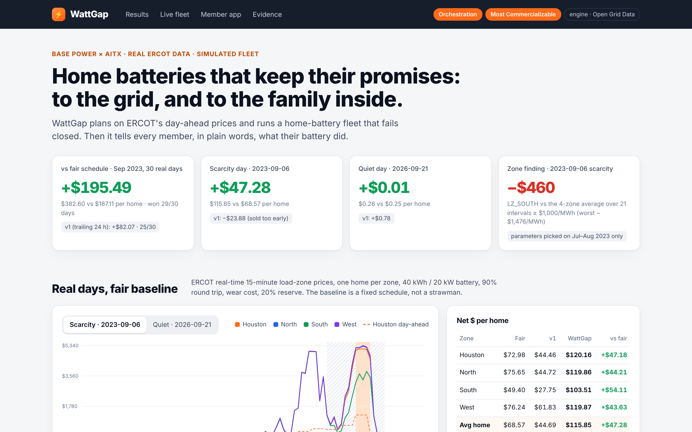
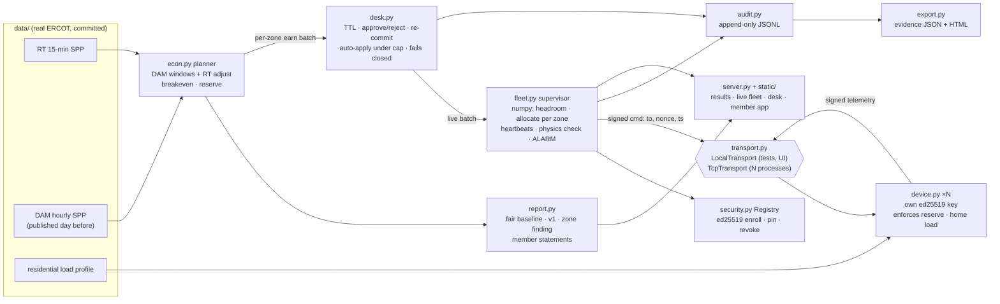

# WattGap

**A home-battery fleet that plans on ERCOT's day-ahead prices, keeps its per-zone commitments when devices fail or lie, fails closed without a human, and tells each member what their battery did.**

WattGap reads real ERCOT prices and decides CHARGE / HOLD / DISCHARGE for a fleet of home batteries.
- It **plans on the day-ahead market**, which is published the afternoon before, then adjusts to real-time prices inside that plan.
- It commits megawatts **per load zone**, with failure headroom, through a human dispatch desk that fails closed.
- Every battery holds **its own ed25519 key**. Commands and telemetry are signed, replay-protected and addressed to one device. Keys can be revoked.
- Batteries can run as **separate OS processes talking over localhost TCP**. Kill them with `kill -9` and the supervisor re-spreads the load, or raises an alarm and re-commits the zone lower.
- Every decision lands in an audit log that becomes an evidence pack. The member gets a receipt, a monthly statement, a Protect switch for storms, and a bill view that marks the unknown tariff as an assumption.

**Base Power × AITX Talent Hackathon** · Austin · Sep 25–27, 2026
**Tracks entered:** **Orchestration** + **Most Commercializable**. Open Grid Data is the engine underneath (real ERCOT prices, fair-baseline economics, a zone-congestion finding), not a third entry. The rules allow two tracks per project.



## Results (real ERCOT prices, simulated batteries)

From `make report`, $ per home, averaged over one home in each of the four load zones. **v1** is the earlier trailing-24 h rule, kept as a comparison row.

| Day (Central time) | Naive overnight | **Fair schedule** | v1 (trailing 24 h) | **WattGap (day-ahead plan)** | **Gap vs fair** (v1 → now) |
|---|---:|---:|---:|---:|---:|
| 2023-09-06, ERCOT scarcity evening | $0.17 | $68.57 | $44.69 | **$115.85** | −$23.88 → **+$47.28** |
| 2026-09-21, ordinary day this week | $0.06 | $0.25 | $1.03 | **$0.26** | +$0.78 → **+$0.01** |
| **Sep 1–30 2023, 30 real days** | | $187.11 | $269.17 | **$382.60** | +$82.07 → **+$195.49** |

WattGap won **29 of 30** September days (v1 won 25). Best day Sep 8 (+$68.42). Worst day Sep 5 (**−$4.31**). The lowest state of charge anywhere is 20%.

- **Fair schedule** means charging 00:00–06:00 CT and discharging evenly over 17:00–21:00 CT. That's the baseline to beat. "Naive overnight" charges at night and never discharges, so it's shown only for reference.
- **How the planner works.** Before each day it reads that day's ERCOT **Day-Ahead Market** prices for the zone. ERCOT clears and publishes them around 13:00 CT the day before, so this is information a real operator had, not hindsight.
  - It plans to discharge in the day's most expensive DAM hour, spreading usable energy over it. During that hour it only sells while real time is above breakeven.
  - It plans to charge in the two cheapest DAM hours (the time a full refill takes), only when real time is cheap enough to pay back after losses and wear.
  - Outside the plan, it sells at full power only if real time beats the day's top DAM price by 1.25×. It plans nothing at all if the day-ahead spread doesn't cover losses and wear.
  - Real-time prices are only read up to the current interval, and a test checks causality.
- **The spike day, explained.** v1 sold at 13:45 CT when prices first hit its trailing top 10%, and sat at its reserve through the 18:30–19:30 peak. The day-ahead plan marked 19:00 as every zone's top hour. When real time ran past 1.25× that DAM peak it sold into the spike instead: the Houston home discharged 30.4 kWh from 15:00 to 16:45 CT at up to $5,013.51/MWh and made $120.16.
- **The quiet day is basically flat** (+$0.01). The DAM spread on 2026-09-21 barely clears losses and wear, so the planner mostly holds. v1 made $0.78 more that day by trading small real-time wiggles. We report it as it came out.
- **How parameters were chosen, not tuned to Sep 6.** The two knobs (discharge window 1–6 h, spike multiple off/1.0–3.0) were picked by grid search on **Jul 2–Aug 31 2023 only** (`make params`, full table in [docs/PARAMS.md](docs/PARAMS.md)). September and the 2026 days were never used to choose a value.
  - **Disclosure 1:** the grid was widened once, because the first best value sat at its edge.
  - **Disclosure 2:** the first planner version had a charge window the same length as the discharge window and scored each day independently. On September it made $256.28/home, which is less than v1. Seeing that, we sized the charge window by physics (refill time) and switched to continuous scoring. That design change was informed by the evaluation month, even though no parameter value was chosen on it.
- **Zone finding (Open Grid Data).** During the 21 scarcity intervals on 2023-09-06 (four-zone average ≥ $1,000/MWh, 13:45–20:15 CT), **LZ_SOUTH cleared $460/MWh below the four-zone average on average, and $1,476/MWh below at worst**. Houston, North and West sat $109–$181 above it. Over September, the same battery made **$318.14 in South vs $412.95 in West**.
- **Home load nets out.** Each home's use comes from ERCOT's published residential load profile (RESHIWR, average premise; see provenance). Over September the Houston battery discharged 525.2 kWh: **87.8 kWh powered the home itself and 437.4 kWh went past the meter.** The dollar value is unchanged, since energy is priced at the load-zone price either way. The split is what a member's meter and Base's settlement would see.

Economic assumptions (stated, not Base Core specifications):
- 40 kWh / 20 kW battery, 90% round-trip efficiency (√0.9 on each leg)
- $0.02/kWh wear cost on energy discharged
- 20% reserve that is never discharged
- 15-minute settlement at load-zone real-time prices
- Energy left at the end of a run valued at that day's median zone price, so policies aren't rewarded for selling off their starting charge

## Quick start

```bash
git clone https://github.com/saivarun3407/wattgap && cd wattgap
make setup        # python3 -m venv .venv && pip install -r requirements.txt   (Python 3.11+)
make test         # 59 tests, ~15 s
make demo         # the scripted story, ~8 s; writes out/evidence.{json,html} and out/audit.jsonl
make demo-net     # 400 batteries as 40 OS processes over localhost TCP, with a real kill -9; ~3 s
make report       # economics on the real days
make serve        # web UI at http://localhost:8000
make cov          # tests with line coverage
make params       # re-run the planner parameter search on the Jul-Aug selection days
make bench        # tick latency and throughput, 1k to 10M units (a few minutes)
```

No API keys. No network access at runtime; the ERCOT data is committed in `data/`.

## The demo (`make demo`)

It replays **2023-09-06** from 14:15 CT with **400 battery devices**. Each one is an independent asyncio task holding its own ed25519 key.

1. The economics table and zone finding (as above).
2. **400 devices enroll.** Each sends its public key with a proof of possession, and the registry pins it.
3. At 14:45 real time ($1,538/MWh) runs past 1.25× South's top day-ahead price ($1,041). The planner opens **B001: 1.19 MW in LZ_SOUTH**. That's above the 0.25 MW auto-apply cap, so it **waits for the desk**. The operator approves.
4. **Kill 30% of LZ_SOUTH**, the zone the batch is committed in. The next tick delivers 0.83 of 1.19 MW and raises an **ALARM**. The tick after, the zone's other 70 units cover it: **1.19 MW delivered**.
5. **A rogue unit reports 100% SoC while physics says 90%: quarantined**, and the operator **revokes its key**. A command signed with the wrong key is rejected (**bad signature**). A captured command replayed is rejected (**replayed nonce**). A valid command re-addressed to another battery is rejected (**addressed to another device**).
6. **B002: 3.80 MW across all four zones**, approved. **All of LZ_WEST is partitioned.** First the ALARM that units went silent, then **"LZ_WEST short by 1.206 MW"**, and the supervisor **re-commits** that zone from 1.206 to 0 MW, with an audit line saying why. Then a **stale price feed** means HOLD everything.
7. **The desk dies.** B003 and B004 expire ("desk-dead"), and **0 ticks discharge without a live batch**.
8. The desk comes back, the operator approves B005 (2.15 MW), then **Protect**: the live batch is cancelled and every reserve is locked at its current charge.
9. **Evidence pack**:

```
  decisions_count                22
  approvals_count                3
  expirations_count              2
  alarms_count                   3
  recommits_count                1
  quarantines_count              1
  revocations_count              1
  security_count                 3
  discharge_without_live_batch   0
  mwh_delivered                  4.536
  mwh_exported                   3.07
  wrote out/evidence.json, out/evidence.html, out/audit.jsonl (413 lines)
```

The demo is deterministic: two runs print identical output.

### Across a real network boundary (`make demo-net`)

The same fleet, but each battery lives in a separate OS process: **40 host processes with 10 devices each**, started with `python -m wattgap.unithost`. Each device generates its private key **inside its own process**, opens its own TCP connection to the supervisor on 127.0.0.1, and speaks newline-delimited signed JSON. From one run:

```
  400 ed25519 public keys enrolled in 1.5 s (each private key was generated inside its device's process)
    tick round trip over TCP: 66 ms
  operator APPROVED B001: 1.19 MW in LZ_SOUTH
  kill -9 1947472  (10 devices: core-00082 … core-00118)      # three South host processes, real SIGKILL
  15:15 CT  target 1.19 MW  delivered 0.83 MW   ALARM: delivered 0.831 of 1.187 MW (units went silent or failed checks)
  15:30 CT  target 1.19 MW  delivered 1.19 MW
  37/40 host processes still running; the target was re-spread over them
```

Tests use an in-process fake transport (`LocalTransport`), so they stay fast. One test runs the TCP transport with 8 processes and a real SIGKILL.

## Architecture



**Tech stack:** Python 3.11+ with `asyncio`, **numpy** for the per-tick fleet math, **cryptography** (ed25519), and `multiprocessing` for benchmark shards. FastAPI + Uvicorn serve the web app: one static page, vanilla JS and inline SVG, no build step. Tests use pytest + pytest-cov. Playwright (optional) takes screenshots, and pandas/openpyxl/requests (optional) re-download the data.

| Module | What it does |
|---|---|
| `wattgap/data.py` | Loads the committed ERCOT CSVs: RT intervals with home load, DAM hours; selection/evaluation split |
| `wattgap/econ.py` | Battery physics, fair baselines, v1, the day-ahead planner, reason text, backtest |
| `wattgap/report.py` | Real days, the September month, zone finding, member statements |
| `wattgap/fleetmath.py` | Vectorized headroom, per-zone allocation, SoC physics check, heartbeat states |
| `wattgap/fleet.py` | The supervisor: per-zone commitments, re-commit, chaos, Protect (fleet and per home), views |
| `wattgap/desk.py` | Batches with per-zone MW, TTL, approve/reject/protect/recommit, fail-closed on desk death |
| `wattgap/security.py` | ed25519 signing, verification (time window, nonce, addressee), device registry with pinning and revocation |
| `wattgap/device.py` | One battery: its own key, verifies commands, enforces the reserve, signs telemetry with home load |
| `wattgap/transport.py` · `unithost.py` | In-process transport, and TCP transport with devices in separate processes |
| `wattgap/shard.py` · `bench.py` | Multiprocess shards (vectorized math, or the full signed path) and the benchmark |
| `wattgap/audit.py` · `export.py` | JSONL audit and the evidence pack |
| `wattgap/live.py` · `demo.py` · `netdemo.py` · `server.py` | A running fleet replaying one day; the scripted stories; the web app |

### How the pieces behave

- **Per-zone commitments.**
  - When a zone is worth earning in, the planner commits **70%** of what that zone's healthy units can sustain for the batch's hour. The other 30% is failure headroom.
  - Each tick, the zone's MW is spread over its healthy units in proportion to their 15-minute headroom, within power and reserve limits.
  - If units go silent or fail checks, the next tick re-spreads the load. If the zone's healthy capacity can't cover its commitment, the supervisor raises **ALARM: LZ_X short by N MW**, runs degraded, and **re-commits** the zone lower (never higher) with an audit line.
- **Desk.** Commitments at or under **0.25 MW** auto-apply, but only while the desk is alive. Anything bigger waits for an operator. Pending batches expire on their TTL (90 s in the demo, 40 s in the UI). If the desk stops heartbeating, all pending batches expire and none can be approved later.
- **Device health.** A unit that misses a heartbeat is *suspect* and gets no work. Two misses make it *dead*. It *recovers* when a signed, plausible reply arrives. A reply whose SoC can't be explained by the commanded power (more than 2 points off) is **quarantined**. A **revoked** key's messages are refused from then on.
- **Security (ed25519, `cryptography`).**
  - Each device generates its own keypair and sends a hello with its public key and a proof of possession. The registry accepts only roster IDs, **pins** the first key (a different key for a known ID is rejected), and refuses revoked IDs.
  - The supervisor signs with `WATTGAP_SUPERVISOR_KEY` (a 64-hex ed25519 seed), and devices pin its public key.
  - Every message carries `to/from device`, nonce and timestamp. Anything outside ±30 s, with a reused nonce, with a bad signature, or addressed to another device is rejected and logged.
- **Protect.** The member's switch cancels that home's earning and locks its reserve at the current charge. Storm mode does the same for every home and cancels live batches. The device enforces the floor itself, because the reserve travels inside every signed command.
- **Home load.** Each device reports its home's current use from the ERCOT residential profile, scaled 0.7–1.3× per home. The supervisor reports MW delivered and MW **past the meter** (after household use).

## Performance (measured)

`make bench` on this box: Python 3.13.5, x86_64, 8 CPUs, 2026-09-25 12:13 CDT. One tick is one 15-minute ERCOT interval.

| Mode | Units | Startup | p50 tick | p95 tick | Unit commands/s | Where |
|---|---:|---:|---:|---:|---:|---|
| fleet (full supervisor, signed) | 1,000 | 0.18 s | 290.6 ms | 291.9 ms | 3,442 | 1 process |
| fleet (full supervisor, signed) | 10,000 | 1.86 s | 2,832.8 ms | 2,958.3 ms | 3,530 | 1 process |
| tcp (devices in processes) | 2,000 | 2.55 s | 376.2 ms | 634.1 ms | 5,316 | 40 device processes |
| signed (ed25519 path, sharded) | 10,000 | 0.30 s | 379.5 ms | 430.5 ms | 26,349 | 8 shard processes |
| signed (ed25519 path, sharded) | 100,000 | 2.31 s | 3,577.0 ms | 3,645.4 ms | 27,956 | 8 shard processes |
| math (vectorized, sharded) | 10,000 | 0.02 s | 0.5 ms | 1.1 ms | 19.3 M | 8 shard processes |
| math (vectorized, sharded) | 100,000 | 0.02 s | 0.9 ms | 1.6 ms | 107.6 M | 8 shard processes |
| math (vectorized, sharded) | **1,000,000** | 0.02 s | **5.2 ms** | **8.8 ms** | 190.9 M | 8 shard processes |
| math (vectorized, sharded) | 10,000,000 | 0.06 s | 94.3 ms | 108.1 ms | 106.1 M | 8 shard processes |

- **fleet** is the real supervisor end to end: plan, allocate, sign one ed25519 command per device, each device verifies, applies, and signs telemetry, then the supervisor verifies every reply and checks physics. **tcp** is the same thing, but over sockets to device processes. **signed** runs the full per-device sign → verify → sign → verify path in 8 shards. **math** is headroom, per-zone allocation, SoC physics and heartbeat state on numpy arrays, with no crypto, in 8 shards.
- **Honest read.** The per-tick fleet *math* is not the bottleneck: 1M units take 5.2 ms median. The cost is **ed25519 per device**, about 290 µs per device per tick on one core (sign 29 µs, verify 91 µs, twice). So the single-process fleet is **slower than the earlier HMAC version** (10k units: 2.83 s now vs 368 ms with HMAC). Sharding across 8 processes brings the signed path back to 380 ms for 10k, and 100k signed devices take 3.6 s, about 0.4% of a 900 s interval. We didn't run the 1M signed path (at ~28k/s it would take about 36 s per tick), and we didn't benchmark a real LTE network.

## Member app (Most Commercializable)

Base is a power company, not a battery company, so the member app talks about the home, not the hardware.
- **First run:** a four-step onboarding explains the battery's two jobs (backup and grid), the 20% backup floor in hours of use, Protect for storms, and receipts.
- **Today:** a live ring with charge, the backup floor and hours of average use stored, plus the receipt for the day: events with times and peak prices, kWh to the home vs exported, and "your backup never dropped below 20%".
- **Month:** the September 2023 statement on real prices. For Houston that's $398.40 of grid value vs $190.03 on the fixed schedule, 36 events, 87.8 kWh used at home, 437.4 kWh exported, 3.4 h of backup kept at the floor.
- **Bill:** a toggle between **flat plan / bill credit / no bill link**, under a banner that says plainly we don't know Base's tariff. The grid value is computed. Any bill impact is illustrative, and the credit share is a slider the viewer moves, not a Base number.
- **Protect:** a per-home switch tied to storms and outages. One tap stops earning and locks backup at the current charge, and the battery enforces it even against a bad command. The operator has **Storm mode** for the whole fleet.
- **Accessibility:** a skip link, landmarks and ARIA roles, visible focus, `prefers-reduced-motion`, and responsive layouts down to phone width. The screenshot script fails on any browser console error, and the last run had **0**.

Screenshots (16) are in [docs/shots/](docs/shots): overview, real days, desk, kill/alarm, rebalanced, rogue, onboarding, receipt, statement, bill, Protect, evidence, mobile.

## Reproduce the demo

1. `cp .env.example .env` and set `WATTGAP_SUPERVISOR_KEY` (optional; `python3 -c "import secrets; print(secrets.token_hex(32))"`). If it's unset, an ephemeral dev key is generated and a warning is logged. The Makefile loads `.env`. **No API keys are needed.**
2. `make setup && make demo`. Output goes to `out/`: `audit.jsonl`, `evidence.json`, `evidence.html`. `make demo-net` runs the multi-process version.
3. Web UI: `make serve`, then open http://localhost:8000. It replays 2023-09-06 from 14:15 CT, one interval every 2 s.
   - Chaos buttons: kill 30% of a zone, partition, stale feed, rogue SoC, forged / replayed / redirected command, revoke quarantined keys, storm mode.
   - Approve or reject on the desk, and kill or revive the desk.
   - Use the member app tabs.
   - **Evidence pack ↗** exports the run.
4. Screenshots: `pip install playwright`, then `make serve &` and `make shots` (uses the system Chrome, or run `playwright install chromium`).

## Datasets and provenance

Everything is **real ERCOT data** for LZ_HOUSTON, LZ_NORTH, LZ_SOUTH and LZ_WEST. Full details are in [data/PROVENANCE.md](data/PROVENANCE.md).

| File | Source | Dates (CT) |
|---|---|---|
| `data/ercot_rtm_spp_2023-07_09.csv` | NP6-785-ER Historical RTM Load Zone and Hub Prices (reportTypeId 13061), 15-min | 2023-07-01 → 09-30 |
| `data/ercot_rtm_spp_2026-09-20_21.csv` | NP6-905-CD Settlement Point Prices (reportTypeId 12301), 15-min | 2026-09-20 → 09-21 |
| `data/ercot_dam_spp_2023-07_09.csv` | NP4-180-ER Historical DAM Load Zone and Hub Prices (reportTypeId 13060), hourly | 2023-07-01 → 09-30 |
| `data/ercot_dam_spp_2026-09-20_21.csv` | NP4-190-CD DAM Settlement Point Prices (reportTypeId 12331), hourly | 2026-09-20 → 09-21 |
| `data/ercot_load_profile_reshiwr.csv` | ERCOT Backcasted Load Profiles (2023 workbook; ZP18-68-M daily extract), RESHIWR average premise, 15-min kWh | same days |

Retrieved 2026-09-25 12:03–12:06 CT (`data/retrieved_at.json`) with `scripts/fetch_ercot.py` (`make data`). The battery fleet is **simulated**. No Base data or API is used.

## Tests

`make test` runs **59 tests** in about 15 s. `make cov` reports **96% line coverage** of `wattgap/` (1,569 statements, 69 missed). That includes the device host processes and the benchmark shards.
- **Economics / planner:** reserve never violated; energy conservation with efficiency; $ matches a hand calculation; baselines sane; Central-time hours; causality (future real-time prices can't change a past decision); every day has a complete DAM; charge and discharge windows never overlap; an unprofitable DAM spread plans nothing; the home-load split adds up to discharged energy.
- **Orchestration:** fleet size not hard-coded; no discharge without desk approval; auto-apply only under the cap; expired batches never execute; per-zone headroom; kill 30% of the batch zone and it rebalances to target; a broken zone re-commits lower with an alarm; partition goes suspect, dead, recovered; stale feed holds; rogue SoC quarantined, then revoked; forged, replayed and redirected commands rejected; fleet Protect and member Protect; devices never breach their reserve; exports net out home use; the audit is append-only JSONL.
- **Vectorized math and shards:** allocation proportional per zone with shortfall; usable kW respects reserve and power; the physics check catches a lie but not rounding; heartbeat transitions; sharded math and the sharded signed path.
- **Security:** ed25519 valid / tampered / wrong key / replayed / stale / wrong addressee; registry enrollment, roster check, key pinning, proof of possession, revocation.
- **Network:** 24 devices in 8 processes over TCP, then a real SIGKILL of one host.
- **Entry points:** `make demo`, `make demo-net`, `make report` and the web API, end to end.

## Known limitations

- **The fleet is simulated.** No Base hardware, firmware, telemetry or API. Home load is an ERCOT average-premise profile, scaled per home, not metered data.
- **The planner is simple and rule-based.** It's a day-ahead window plus a real-time override, with two parameters chosen on July–August. It isn't an optimizer and has no price forecast beyond the DAM. It still loses a day in September (Sep 5, −$4.31) and is flat on the quiet day. One design change (sizing the charge window by refill time) was made after looking at September, as disclosed above.
- **The economics are energy-only** at load-zone prices. No ancillary services, retail tariff, demand charges or settlement nuance. Battery specs and wear cost are assumptions.
- **"Congestion" is inferred** from load-zone spreads, not from ERCOT shadow prices.
- **Bill impact is illustrative.** The member app computes grid value. How it reaches a bill depends on Base's plan, which we don't know, and the UI says so.
- **Keys live in memory**, not in a secure element. There's no key rotation ceremony or certificate chain. The supervisor key comes from an environment variable.
- **The network is localhost TCP**, not LTE or MQTT. There's no TLS; integrity comes from the per-message signatures. State lives in memory apart from the JSONL audit.
- **The signed fleet is crypto-bound:** one process handles about 3.5k devices per tick-second. Sharding is benchmarked but the live supervisor runs in one process.

## What existed before the event

Kickoff was **Friday Sep 25, 2026, 5:30 PM CT**. Per `git log`, all of the commits below predate it.

**On `main`, Sep 23, 2026 (CT):** planning docs plus a ~210-line stdlib prototype (`sim/`) that ran on a **synthetic** price file and had a naive baseline stuck at $0.
- `0b42589` 12:35: WattGap opportunity scanner prototype
- `6058376` 12:46: FleetPulse Desk plan
- `9fdeec2` 12:52: unify docs
- `b71b26e` 13:38: roadmap, 11 PRDs, strategy
- `6ab7d19` 13:39: issue template

**On branch `hackathon-build`, Fri Sep 25, 2026, before kickoff:** the code in this README.
- First pass: real data, economics, orchestration with HMAC, export/demo/bench, web UI, docs.
- Second pass: the day-ahead planner, ed25519 devices and the TCP transport, the vectorized fleet with per-zone commitments and home load, the member app and polish, more tests.

The old `sim/` and the synthetic data were deleted. Exact commit times: `git log --format='%h %ad %s' --date=iso main..hackathon-build`. Work done after kickoff will show later timestamps.

## Team

- Sai Varun Reddy Bhemavarapu ([@saivarun3407](https://github.com/saivarun3407))

## Repo map

`README.md` (this file) · [`PROJECT.md`](PROJECT.md) spec · [`HACK.md`](HACK.md) remaining on-site plan · [`docs/HACKATHON.md`](docs/HACKATHON.md) official rules and rubric · [`docs/PARAMS.md`](docs/PARAMS.md) parameter selection · [`data/PROVENANCE.md`](data/PROVENANCE.md) · `wattgap/` code · `tests/` · `scripts/` (data fetch, parameter search, screenshots) · `docs/shots/` screenshots · [`docs/archive/`](docs/archive) pre-event planning (not claims)

MIT licensed.
